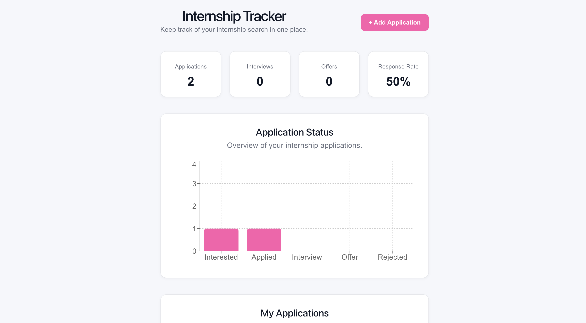

# Internship Application Tracker

A responsive web application designed to help students organize, manage, and track internship applications throughout the recruiting process.

[**Live Demo**](https://graciejones22.github.io/internship-tracker/) · [**GitHub Repository**](https://github.com/graciejones22/internship-tracker)



## Tech Stack

**React** · **TypeScript** · **Vite** · **Recharts** · **CSS** · **LocalStorage**

## Key Features

- **Application Management** — Create, edit, and delete internship applications
- **Search** — Quickly find applications by company or position
- **Filtering** — Filter applications by application status
- **Sorting** — Organize applications based on relevant application details
- **Status Dashboard** — View application progress and status distribution
- **Deadline Tracking** — Keep track of upcoming application deadlines
- **Responsive Design** — Optimized for both desktop and mobile devices
- **Persistent Data** — Application information is saved using browser localStorage

## About the Project

I built this application to solve a problem I was experiencing while applying for internships: keeping track of applications, deadlines, and progress across multiple companies.

The project gave me hands-on experience building an interactive React application, managing state with TypeScript, creating reusable components, working with data visualization, and designing a responsive user interface.

## Technical Highlights

- Built reusable React components using TypeScript
- Implemented full CRUD functionality for internship applications
- Managed application state and dynamically updated the user interface
- Implemented search, filtering, and sorting functionality
- Created data visualizations using Recharts
- Implemented persistent client-side storage with localStorage
- Designed responsive layouts using CSS
- Configured and deployed the application using Vite and GitHub Pages

## Project Structure

```text
internship-tracker/
├── public/
├── src/
│   ├── components/
│   ├── App.tsx
│   ├── main.tsx
│   └── ...
├── screenshots/
│   └── internship-tracker-dashboard.png
├── package.json
├── tsconfig.json
├── vite.config.ts
└── README.md

## Getting Started

### Prerequisites

Make sure you have Node.js and npm installed.

### Installation

Clone the repository:

```bash
git clone https://github.com/graciejones22/internship-tracker.git
```
Navigate to the project directory:
```bash
cd internship-tracker
```
Install dependencies:
```bash
npm install
```
Start the development server:
```bash
npm run dev
```
Open the local development URL provided by Vite in your browser.

## How It Works

Applications are stored in the browser using localStorage. React state is used to manage the application data and update the dashboard whenever applications are added, edited, or deleted.

The application list can be dynamically filtered based on application status and searched by company or position. Applications can also be sorted according to different criteria.

The dashboard calculates application statistics from the stored application data and displays the distribution of applications by status using a bar chart.

## What I Learned

### Through this project, I practiced:

- Building reusable React components
- Managing state with React hooks
- Working with TypeScript interfaces and types
- Handling forms and user input
- Filtering and sorting arrays of objects
- Persisting data with localStorage
- Creating data visualizations with Recharts
- Designing responsive layouts with CSS
- Debugging React and TypeScript errors
- Using Git for incremental version control
- Deploying a web application

## Future Improvements

### Potential future versions could include:

- A backend database
- User authentication
- Cloud data synchronization
- Calendar integration
- Application reminders
- Additional analytics
- Project Development

This project was developed incrementally using Git and GitHub, with separate commits for major functionality and design improvements.

### Author

- Grace Jones
- Computer Science (Software Development)
- Siena University
